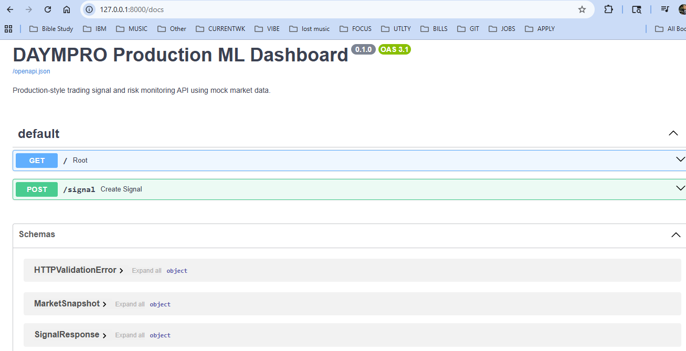
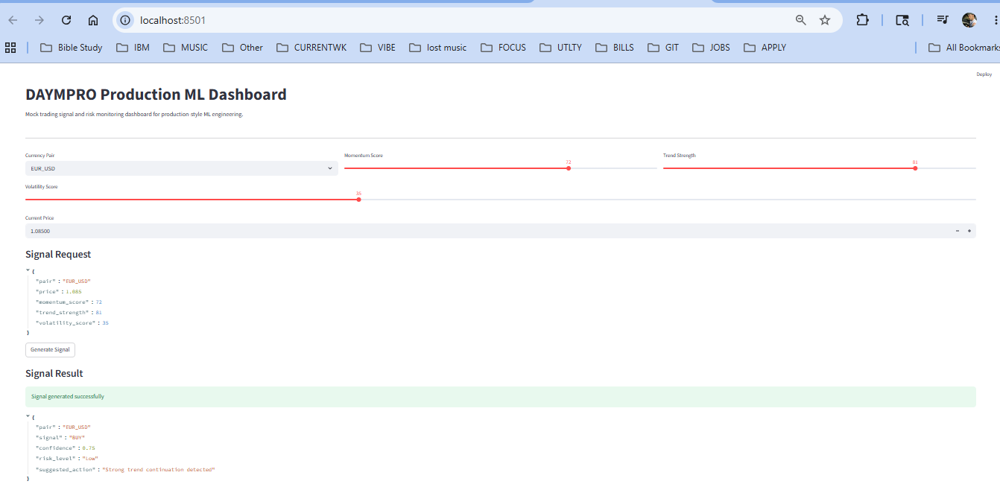
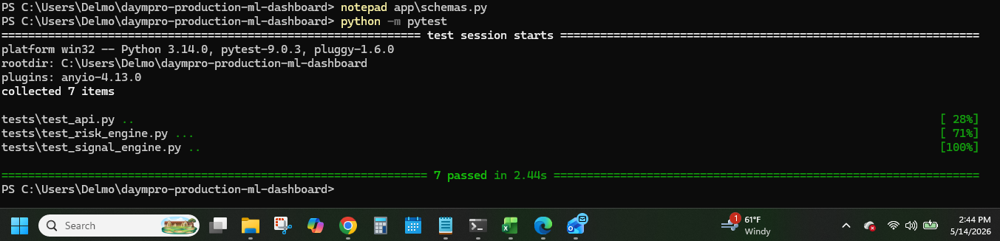

# DAYMPRO Production ML Dashboard

DAYMPRO is a production-style machine learning dashboard for real-time trading signal monitoring, risk analysis, and mock broker-safe decision tracking.

This project is designed as a portfolio-ready AI/ML software engineering system. It demonstrates how signal logic, risk controls, API development, automated testing, and dashboard monitoring can be combined into a clean production workflow.

---

## Project Screenshots

### FastAPI Documentation

### Streamlit Dashboard

### Passing Test Suite

---

## Features

- FastAPI backend for signal and risk endpoints
- Streamlit dashboard for visual monitoring
- Signal engine for market decision logic
- Risk engine for trade safety checks
- Mock broker-safe architecture
- Automated test suite with Pytest
- Modular Python project structure
- Production-style separation of API, engine logic, dashboard, and tests

---

## Tech Stack

- Python
- FastAPI
- Streamlit
- Pytest
- Pydantic
- Uvicorn
- Git / GitHub

---

## Project Structure

daympro-production-ml-dashboard/
- app/
  - main.py
  - signal_engine.py
  - risk_engine.py
- dashboard/
  - app.py
- screenshots/
  - fastapi_docs.png
  - pytest_passed.png
  - streamlit_dashboard.png
- tests/
  - test_api.py
  - test_signal_engine.py
  - test_risk_engine.py
- requirements.txt
- README.md

---

## How to Run

Install dependencies:

pip install -r requirements.txt

Run the FastAPI backend:

python -m uvicorn app.main:app --reload

Run the Streamlit dashboard:

streamlit run dashboard/app.py

---

## Testing

Run the test suite:

python -m pytest

Current result:

7 passed

---

## Portfolio Purpose

DAYMPRO was built as a production-style AI/ML software engineering portfolio project. It is not presented as a profit-guaranteeing trading system. Instead, it demonstrates real-time decision logic, risk monitoring, API development, dashboard design, automated testing, and clean project structure.

---

## Author

**Darrick Elmore**  
AI/ML Software Engineering Portfolio Project